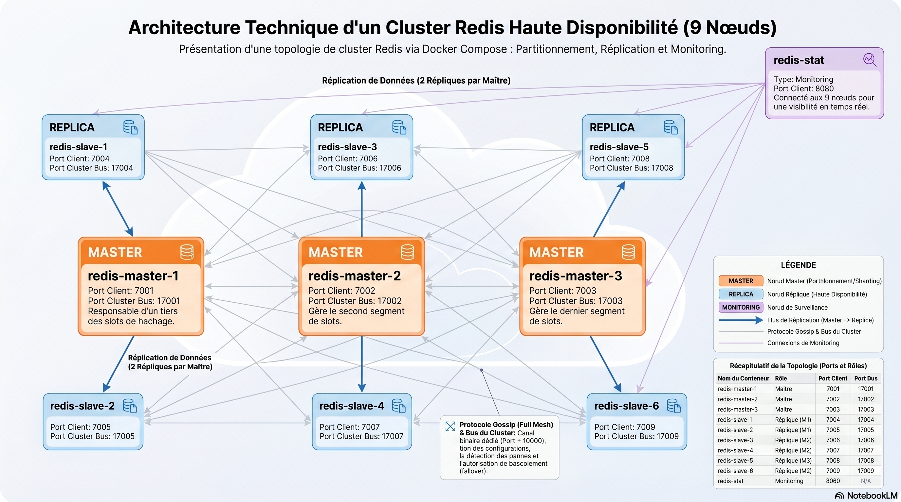

### Deploiement d'un cluster Redis

#### Pre-requis: Avoir docker installer et cloner ce repo
```shell
git clone https://github.com/khadimmbaye0/CLUSTER-REDIS.git
cd CLUSTER-REDIS
```

#### 1- demarrer le cluster
```shell
docker compose -p "redis-cluster" up -d
```

#### 2- Se connecter sur un des noeuds
```shell
docker exec -it redis-master-1 bash
```

#### 3- Se connecter en mode cluster
```shell
redis-cli -c -p 7001
```

#### 4- Afficher les infos concernant le noeud
```shell
cluster info
```

#### 5- Schema de l'architecture du cluster
